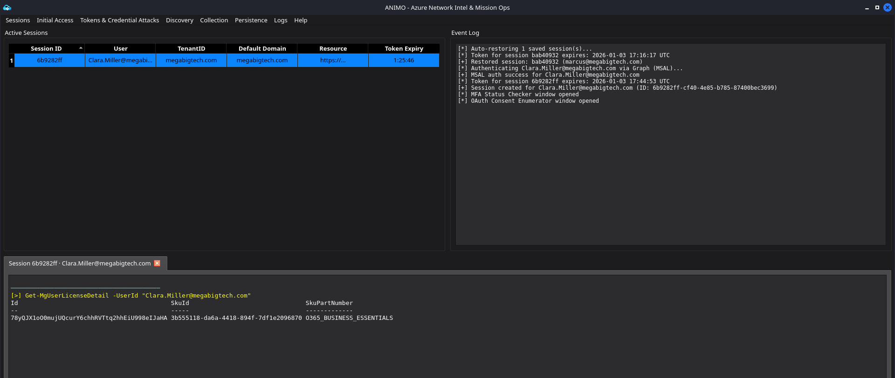
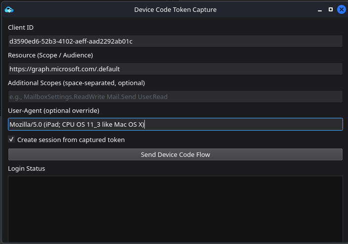
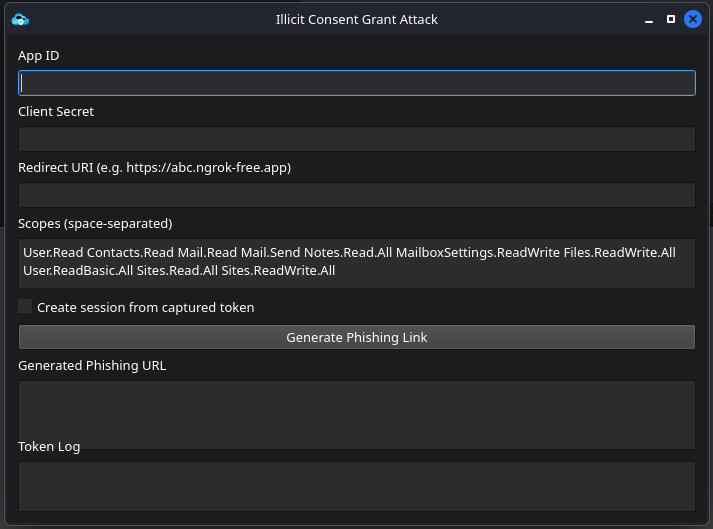
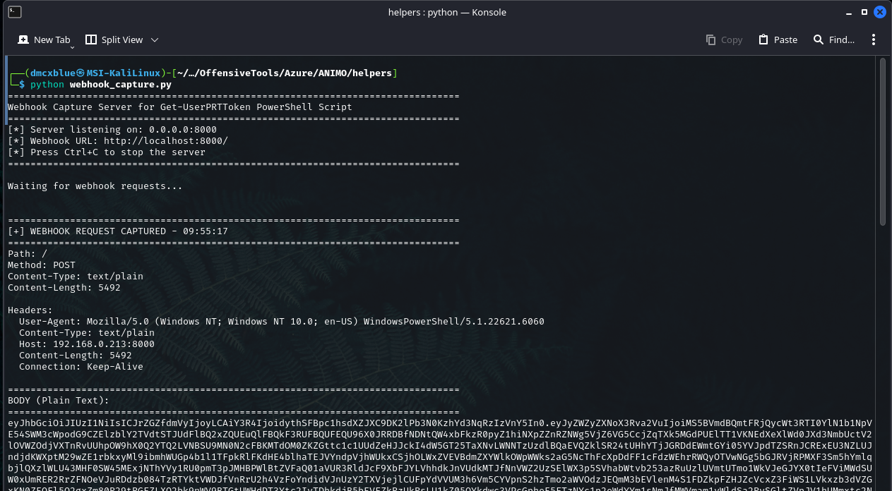
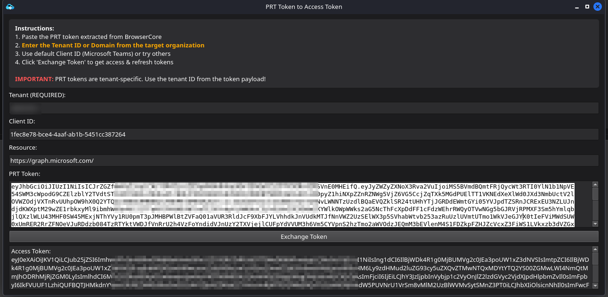
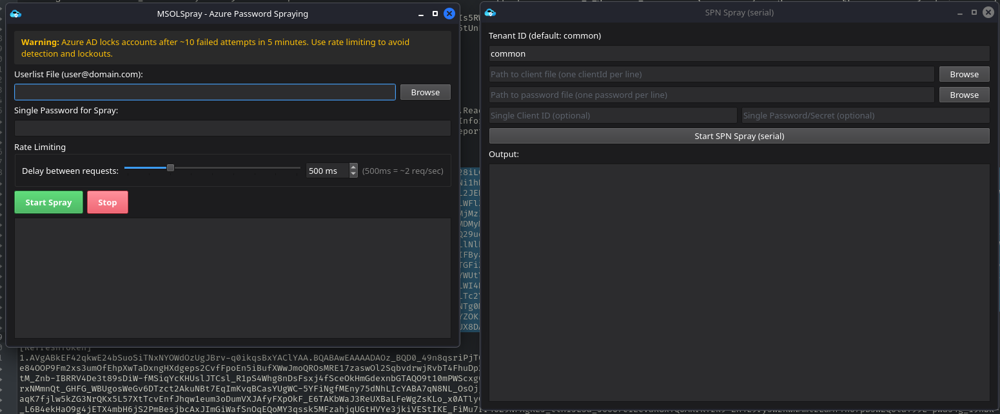

<p align="center">
  
  
  
  
</p>

<h1 align="center">ANIMO</h1>
<h3 align="center">Azure Network Intel & Mission Ops</h3>

<p align="center">
  <i>A unified client-server platform for Azure & Microsoft 365 security assessment</i>
</p>

<p align="center">
  <b>Designed for authorized penetration testing, red team operations, and security research.</b>
</p>

---

## What is ANIMO?

ANIMO is a comprehensive Azure AD / Entra ID assessment platform that combines **PowerShell-based session management**, **Azure CLI parity**, and **native Graph / ARM API integration**. It gives red teamers a single interface to manage multiple Azure sessions, capture and manipulate tokens, enumerate cloud resources, and execute post-exploitation techniques during authorized engagements with WhoAmI-driven autofill so Post-Exploit modules pre-populate from what you already know about the identity.

### Highlights

> - Manage **multiple Azure PowerShell + az cli sessions** simultaneously from one dashboard
> - **Capture, exchange, mint, and analyze** OAuth tokens (access, refresh, PRT, SAS)
> - Discovery: **WhoAmI** with derived Capability verdicts + fine-grained ARM action enumeration
> - **Seamless autofill** WhoAmI findings flow into Post-Exploitation modules with zero re-typing
> - Access **Outlook, Calendar, Teams, OneDrive, SharePoint, Storage, Key Vault** through Graph / ARM
> - Enumerate **subscriptions, VMs, SQL, Function Apps, Logic Apps, Automation Runbooks** and more
> - **Remote Exec** framework: pluggable transports for Azure VM runCommand, uploaded HTTP webshells, and SSTI payload injection (Jinja2 / Twig / Freemarker / Velocity / ERB)
> - **Fresh Entra device registration (DRS)** for cert-based persistence
> - **Auth-method persistence**: TAP issuance, backdoor phone / email / OATH
> - Password / SPN / refresh-token **sprays**
> - AES-256-GCM **encrypted session persistence** with auto-restore on restart
> - Professional engagement **report generation** with session timelines

---

## Screenshots

### Dashboard
<!-- Add screenshot: screenshots/dashboard.png -->
<p align="center">
  
</p>

---

## Quick Start

### Prerequisites

| Requirement | Version |
|:------------|:--------|
| OS | Linux (Kali recommended, build verified), macOS, or Windows — natively or via WSL2 |
| Qt6 | 6.2+ (Widgets, Network, WebEngineWidgets, Sql; plus the Svg image plugin for the app icon) |
| CMake | 3.16+ |
| PowerShell | 7.x (`pwsh`) |
| Azure CLI | 2.x (`az`) optional but recommended for parity |
| Python | 3.8+ with `msal`, `requests` |

### Install & Build (Linux)

```bash
# Clone the repository
git clone https://github.com/dmcxblue/ANIMO.git
cd ANIMO

# Install system dependencies (Debian / Ubuntu / Kali)
./install-dependencies.sh

# Install PowerShell modules
pwsh -File Install-AllModules.ps1

# Build
./build.sh
```

### Build on Windows

The CMake project is cross-platform and `Install-AllModules.ps1` runs on both
platforms, but the build itself is currently only verified on Linux. On Windows,
install the prerequisites yourself and invoke CMake directly:

```powershell
# Prerequisites (via winget, or the Qt Online Installer for Qt itself)
winget install -e --id Kitware.CMake
winget install -e --id Ninja-build.Ninja
winget install -e --id ShiningLight.OpenSSL.Light
# Qt 6.2+ with the Qt WebEngine and Qt SQL modules, plus MSVC (Visual Studio
# Build Tools with the C++ workload). Note the Qt install prefix.

# PowerShell modules
pwsh -File Install-AllModules.ps1

# Configure and build - point CMAKE_PREFIX_PATH at your Qt6 install
cmake -B build -G Ninja -DCMAKE_BUILD_TYPE=Release `
      -DCMAKE_PREFIX_PATH="C:/Qt/6.7.2/msvc2019_64"
cmake --build build
```

Binaries land in `build\server\AnimoServer.exe` and `build\client\AnimoClient.exe`.
The hardening flags in the top-level `CMakeLists.txt` are GCC/Clang-only and are
skipped under MSVC. `build.sh` and `clean.sh` are bash scripts use the CMake
commands above, or run them from WSL2.

### Launch

```bash
# Start the server
./build/server/AnimoServer -i 0.0.0.0 -p 7777 -P <YourPassword>

# Start the client (separate terminal)
./build/client/AnimoClient
```

Connect to the server using the client login window with your server IP, port, and password.

---

## Modules

Modules are organised by the menu the operator uses to reach them.

### Initial Access

Login flows that turn credentials, tokens, or consent grants into an authenticated ANIMO session.

#### Device Code Phishing
Runs the OAuth 2.0 device-code flow so the operator can send the `microsoft.com/devicelogin` URL + code to a target. When the target authenticates, the captured access / refresh token is auto-logged and (optionally) becomes a full server session. Supports specifying the target resource (Graph, Management, Key Vault, Storage, custom).
<!-- Add screenshot: screenshots/device-code.png -->
<p align="center">
  
</p>

#### Credential Login (ROPC)
Direct username-and-password login via MSAL's Resource Owner Password Credentials flow. Bootstraps both Az PowerShell (`Connect-AzAccount -Credential`) and Azure CLI (`az login -u -p`) in the session terminal so both toolchains have valid contexts. Includes a resource dropdown (Management / Graph / Key Vault / Storage / SQL / custom).
<!-- Add screenshot: screenshots/credential-login.png -->
<p align="center">
  
</p>

#### Token Login
Paste an existing access token (with optional refresh token) to instantiate a session without re-authentication. The token's `aud` claim determines the resource; the JWT is parsed for identity / expiry so the session dashboard row is populated correctly.
<!-- Add screenshot: screenshots/token-login.png -->
<p align="center">
  
</p>

#### Service Principal Login (SPN)
Sign in as a Service Principal using `{appId, clientSecret, tenantId}`. Runs `Connect-AzAccount -ServicePrincipal` + `az login --service-principal`, then enumerates the SPN's subscriptions and pins the first one for scope-less cmdlets to work out of the box. Resource dropdown supports Management / Graph / Key Vault / Storage / SQL.
<!-- Add screenshot: screenshots/spn-login.png -->
<p align="center">
  
</p>

#### Illicit Consent Grant
Serves an OAuth consent page from a local listener, capturing the code exchange when a target grants consent to a rogue app. Configurable redirect URI, scopes, and port; the resulting tokens are auto-logged and optionally converted to a session.
<!-- Add screenshot: screenshots/illicit-consent.png -->
<p align="center">
  
</p>

#### Webhook Token Capture
Standalone HTTP listener that receives tokens posted by external implants (e.g. `GrabTokenAzureAD`, `Get-UserPRTToken`). Modes: capture all tokens / PRT-only / access-refresh-only every captured token drops into the Token Log automatically.
<!-- Add screenshot: screenshots/webhook-capture.png -->
<p align="center">
  
</p>

---

### Tokens

Fine-grained token manipulation across resources.

#### Refresh Tokens
Exchange a refresh token for new access tokens against arbitrary Microsoft resources. Handy for pivoting from a Graph refresh token into a Management or Key Vault token when the audience-scope you originally obtained isn't what you need next.
<!-- Add screenshot: screenshots/refresh-tokens.png -->
<p align="center">
  
</p>

#### PRT Tokens
Redeem a Primary Refresh Token to mint arbitrary-resource access tokens via the `x-ms-RefreshTokenCredential` cookie flow. Automates the exchange loop and drops the resulting tokens into the Token Log tagged with the user + resource.
<!-- Add screenshot: screenshots/prt-tokens.png -->
<p align="center">
  
</p>

#### SSO Tokens
Converts a captured SSO cookie (e.g. `ESTSAUTHPERSISTENT`) into a bearer access token via the OAuth authorization-code flow. Useful when the only credential material you have is a browser cookie.
<!-- Add screenshot: screenshots/sso-tokens.png -->
<p align="center">
  
</p>

---

### Credential Attacks

Bulk credential guessing and app-secret injection.

#### Password Spray (MSOL)
Sprays a single password against a userlist targeting the legacy MSOL endpoint. Configurable per-attempt delay to stay under lockout thresholds; results table highlights valid credentials as they land.
<!-- Add screenshot: screenshots/password-spray.png -->
<p align="center">
  
</p>

#### SPN Secret Spray
Serial spray of `{clientId, clientSecret}` combinations against a tenant's OAuth2 token endpoint. Loads client-id / secret files or accepts a single pair; tenant field auto-fills from the last WhoAmI snapshot.
<!-- Add screenshot: screenshots/spn-spray.png -->
<p align="center">
  
</p>

#### Refresh Token Spray
Tests a single refresh token against ~10 curated Microsoft first-party app IDs from `helpers/auth_apps.json`, identifying which apps accept it. Reports scopes granted for each successful app and can auto-check for privileged permissions.
<!-- Add screenshot: screenshots/refresh-spray.png -->
<p align="center">
  
</p>

#### Add App Secret
Adds a new client secret (or certificate credential) to an Azure AD Application registration. Requires an owner or Application Administrator role on the target app; the new secret can be immediately used to obtain SPN tokens.
<!-- Add screenshot: screenshots/add-app-secret.png -->
<p align="center">
  
</p>

---

### Discovery

Enumeration of directory objects, RBAC assignments, tenant policies, and cloud resources.

#### WhoAmI (Entra / Azure)
Comprehensive read-only identity dump for the selected session: identity + JWT claims, groups, admin roles (active + PIM eligible), owned objects, Azure RBAC assignments across every accessible subscription, auth methods, licenses, OAuth grants, and token permissions. Includes a **Capabilities** tab with derived yes/no verdicts (register apps, run VM commands, reset passwords, grant admin consent, etc.) and a **fine-grained ARM actions** tree enumerated via `az role assignment list` + `az role definition list` that catches custom roles with `Microsoft.Authorization/roleAssignments/write` and similar. Publishes findings to `WhoAmiInsights` so downstream Post-Exploitation modules autofill their fields.
<!-- Add screenshot: screenshots/whoami.png -->
<p align="center">
  
</p>

#### Tenant Search (Files / Mail / Chat)
Single `POST /v1.0/search/query` returns hits across OneDrive / SharePoint (`driveItem`), mail (`message`), Teams (`chatMessage`), calendar (`event`), and sites — the fastest way to hunt for credentials with keywords like `password | secret | vpn`. Results grouped by entity type; CSV / JSON export.
<!-- Add screenshot: screenshots/tenant-search.png -->
<p align="center">
  
</p>

#### Subscriptions & Resources
Enumerates every Azure subscription the identity can reach and, per subscription, the resources within (VMs, Storage, Key Vaults, App Services, SQL, etc.). Highlights resources with managed identities and includes IMDS attack hints for those.
<!-- Add screenshot: screenshots/azure-enum.png -->
<p align="center">
  
</p>

#### Conditional Access Policies
Reads the tenant's Conditional Access policies via Graph and displays them in a structured tree with an analysis pane. Useful for identifying policies you might trigger (or ways to bypass MFA gaps).
<!-- Add screenshot: screenshots/conditional-access.png -->
<p align="center">
  
</p>

#### Cross-Tenant Access Policies
Displays the tenant's default cross-tenant access settings and per-partner B2B / B2C configurations. Read-only; helps identify partner tenants that could provide privilege escalation paths.
<!-- Add screenshot: screenshots/cross-tenant.png -->
<p align="center">
  
</p>

#### MFA Status Checker
Enumerates every user's registered authentication methods via `/authentication/methods` and marks users as `PROTECTED` (has MFA) or `VULNERABLE` (password only). CSV export for the vulnerable list feeds directly into a spray target file.
<!-- Add screenshot: screenshots/mfa-checker.png -->
<p align="center">
  
</p>

#### Password Writeback Checker
Detects whether Azure AD Connect password-writeback is enabled and enumerates who holds the on-premises admin roles needed to abuse it. Combined with hybrid-identity findings, tells you whether an Entra-first breach could burn down to on-prem.
<!-- Add screenshot: screenshots/password-writeback.png -->
<p align="center">
  
</p>

#### OAuth Consent Grants
Enumerates every consent grant (`oauth2PermissionGrants`) issued in the tenant, highlighting `AllPrincipals` grants and apps without a redirect-URI restriction — the primary consent-abuse discovery pane.
<!-- Add screenshot: screenshots/oauth-consent.png -->
<p align="center">
  
</p>

#### Graph Query
Raw Graph API request builder — pick GET / POST, paste a URL, optionally attach a JSON body, and hit send. Host-locked to `graph.microsoft.com` with automatic bearer-token attachment; the response renders with syntax highlighting.
<!-- Add screenshot: screenshots/graph-query.png -->
<p align="center">
  
</p>

#### Key Vault Explorer
Enumerates Key Vaults across accessible subscriptions and browses secrets / keys / certificates within each vault. Automatically detects Vault-audience tokens and mints one via the cascade when needed.
<!-- Add screenshot: screenshots/keyvault.png -->
<p align="center">
  
</p>

#### SQL Database Explorer
Lists Azure SQL servers and databases; supports both AAD-authenticated and SQL-authenticated (username / password) queries. Executes arbitrary T-SQL against a chosen database and returns results in a table.
<!-- Add screenshot: screenshots/sql-explorer.png -->
<p align="center">
  
</p>

#### Virtual Machines
Enumerates VMs across subscriptions, showing OS type, power state, and location. Includes a **Run Command** tab that dispatches PowerShell (Windows) or shell script (Linux) via ARM `runCommand` — properly polls the async operation URL so the output actually comes back.
<!-- Add screenshot: screenshots/vm-manager.png -->
<p align="center">
  
</p>

#### Automation Runbooks
Enumerates Azure Automation accounts and their runbooks. Displays runbook code and lets the operator inspect the execution history useful for finding stored credentials or lateral-movement primitives.
<!-- Add screenshot: screenshots/runbooks.png -->
<p align="center">
  
</p>

#### Service Principals / Apps
Enumerates Service Principals AND Application Registrations, showing appId, service principal type, sign-in audience, and account status. Right-click a Service Principal to send it to Add App Secret or the Graph Query window.
<!-- Add screenshot: screenshots/spn-enum.png -->
<p align="center">
  
</p>

#### Function Apps
Lists Function Apps across accessible subscriptions with their triggers, code (where readable), and app settings — a rich source of secrets and pivot points.
<!-- Add screenshot: screenshots/function-apps.png -->
<p align="center">
  
</p>

#### Logic Apps
Enumerates Logic Apps and their workflow definitions. Workflow JSON often exposes connection secrets or webhook URLs the operator can abuse for lateral movement.
<!-- Add screenshot: screenshots/logic-apps.png -->
<p align="center">
  
</p>

---

### Collection (M365 Data Harvesting)

Reads user data through Graph the exfiltration surface.

#### Outlook Email
Full Outlook mailbox client: read / search / reply / forward / send / delete emails via Graph's `/messages` endpoints. Supports HTML compose with attachments and a preview pane that renders the message body safely.
<!-- Add screenshot: screenshots/outlook-email.png -->
<p align="center">
  
</p>

#### Outlook Calendar
Read the user's calendar via Graph meetings, attendees, dial-in info, attached files. Handy for identifying targets, meeting patterns, and confidential information embedded in invites.
<!-- Add screenshot: screenshots/outlook-calendar.png -->
<p align="center">
  
</p>

#### Teams Messages
Browses joined Teams and channels, reads chat conversations, and can send messages using either Graph (`/chats/`) or the Skype API. Search across messages for keyword hunting.
<!-- Add screenshot: screenshots/teams.png -->
<p align="center">
  
</p>

#### SharePoint / OneDrive Files
Tree-style file browser over `/drives/` traverse OneDrive personal drives and SharePoint document libraries, download files, and preview content. Feeds directly into the exfiltration workflow.
<!-- Add screenshot: screenshots/sharepoint.png -->
<p align="center">
  
</p>

#### Storage Explorer
Enumerates Azure Storage accounts and browses blob containers, file shares, tables, and queues. Supports both **bearer-token** (Connected Account) and **SAS token** authentication — paste a SAS query string and every list / download call uses it automatically.
<!-- Add screenshot: screenshots/storage-explorer.png -->
<p align="center">
  
</p>

---

### Persistence

Long-term footholds that survive password reset or session expiry.

#### Email Inbox Rules
Creates hidden Outlook inbox rules that forward / redirect / delete matching messages — the classic BEC persistence primitive. Supports keyword filters (`invoice | payment | wire`), stealth flags (hidden rule name, stop-processing-more-rules), and per-rule sequence ordering.
<!-- Add screenshot: screenshots/email-rules.png -->
<p align="center">
  
</p>

#### Consent Manipulation
Approves pending admin consent requests, adds delegated permission grants (`oauth2PermissionGrants`), and assigns app roles (`appRoleAssignments`). Once you have Application / Cloud Application / Global Admin, this window silently grants an attacker-owned app whatever permissions it needs.
<!-- Add screenshot: screenshots/consent-manipulation.png -->
<p align="center">
  
</p>

#### Auth Methods (TAP / Backdoor MFA)
Injects authentication methods against a target user: **Temporary Access Pass** (returns the passcode inline), phone (SMS / voice), alternative email, and Software OATH. Auth Admin / Priv Auth Admin / Global Admin can mint a TAP that satisfies MFA and lets the operator sign in as the target without a password reset alert.
<!-- Add screenshot: screenshots/auth-methods.png -->
<p align="center">
  
</p>

#### Fresh Device Join (DRS)
Native implementation of the Entra Device Registration Service wire protocol joins a fresh fake device to the tenant and receives back a signed X.509 device certificate. The cert survives password reset and is the modern-tradecraft equivalent of a golden ticket for cloud identities. Encrypted at rest under `data/device_certs.dat`.
<!-- Add screenshot: screenshots/device-join.png -->
<p align="center">
  
</p>

#### Windows Hello Attack
Registers a WHfB credential on the compromised account by running the AAD Internals device-and-key registration flow. Once registered, the operator can mint PRTs for the victim independently of their password.
<!-- Add screenshot: screenshots/whfb-attack.png -->
<p align="center">
  
</p>

---

### Post-Exploitation

Top-level tabbed window covering directory-side attack primitives. Fields **autofill from WhoAmI** the Role Assignment tab's principal / subscription / scope populate from the last WhoAmI snapshot, and a "From WhoAmI" combo lists every RBAC scope the identity holds so the operator picks one instead of retyping.

- **User Groups** — search users / groups, add users to security groups
- **App Backdoors** — create backdoor Application registrations
- **Password Reset** — PATCH `/users/{id}` passwordProfile
- **Role Assignment** — assign Azure RBAC roles at any scope; scope picker prefilled from WhoAmI
- **Guest Invite** — B2B `POST /invitations` with silent-invite options
- **SPN Enumeration** — search Service Principals + inspect credentials

<!-- Add screenshot: screenshots/post-exploit.png -->
<p align="center">
  
</p>

---

### Remote Exec

Interactive shell UI over a pluggable transport framework the same "target → command → output" mental model whether the payload lands via Azure runCommand, an uploaded PHP webshell, or a SSTI injection point.

- **Azure VM (runCommand)** — properly polls the ARM async operation; one-click "Grab MI Token from IMDS" for Managed Identity theft
- **HTTP Webshell** — for uploaded `cmd.php`-style RCE; configurable output extractor (raw / regex / between markers)
- **HTTP SSTI** — payload templating with presets for Jinja2, Twig, Freemarker, Velocity, ERB, or custom
- **Persistent target list** — saved targets survive restarts (encrypted at rest)

<!-- Add screenshot: screenshots/remote-exec.png -->
<p align="center">
  
</p>

---

### Logs & Reporting

#### Token Logs
Chronological view of every captured token, decorated with source (device-code / credential / SPN / webhook / cascade-mint / etc.), user, resource, and expiry. Export / import / delete per row.
<!-- Add screenshot: screenshots/token-log.png -->
<p align="center">
  
</p>

#### Activity Log
Consolidated event feed: session creations, session exits, token issuances, and command activity in a single sortable timeline.
<!-- Add screenshot: screenshots/activity-log.png -->
<p align="center">
  
</p>

#### Token Lifetime Analysis
JWT decoder — paste any bearer / refresh token to see claims, expiry, audience, issuer, and scopes / roles broken down with syntax highlighting.
<!-- Add screenshot: screenshots/token-analysis.png -->
<p align="center">
  
</p>

#### Session Timeline
Per-session activity timeline showing token issuance, expiry, refresh events, and command activity as a visual scroll. Useful for reconstructing the engagement narrative for the report.
<!-- Add screenshot: screenshots/session-timeline.png -->
<p align="center">
  
</p>

#### Engagement Report
Generates a professional HTML report summarising sessions, captured tokens, enumeration findings, and post-exploitation actions from the current data directory. Ready to drop into a client deliverable with minimal editing.
<!-- Add screenshot: screenshots/engagement-report.png -->
<p align="center">
  
</p>

---

## Architecture

```
┌─────────────────────────────────────────────────────────────────┐
│                         AnimoClient                             │
│  ┌─────────────┐  ┌─────────────┐  ┌─────────────────────────┐  │
│  │ Dashboard   │  │  Plugin     │  │ Direct API Calls        │  │
│  │ (Sessions)  │  │  Windows    │  │ (Graph, ARM, Vault)     │  │
│  └──────┬──────┘  └──────┬──────┘  └────────────┬────────────┘  │
│         │                │                       │              │
│         └────────────────┴───────────────────────┘              │
│                          │                                      │
│                   ClientTransport                               │
│                          │ TCP / JSON                           │
└──────────────────────────┼──────────────────────────────────────┘
                           │
                           ▼
┌─────────────────────────────────────────────────────────────────┐
│                         AnimoServer                             │
│  ┌────────────────────────────────────────────────────────────┐ │
│  │                    Request Dispatcher                      │ │
│  └──────────┬─────────────────────────────────┬───────────────┘ │
│             │                                 │                 │
│  ┌──────────▼──────────┐         ┌───────────▼───────────┐      │
│  │  PowerShellManager  │         │   SessionDBManager    │      │
│  │  (Sessions: pwsh +  │         │   (SQLite Database)   │      │
│  │   az cli contexts)  │         │                       │      │
│  └─────────────────────┘         └───────────────────────┘      │
└─────────────────────────────────────────────────────────────────┘
```

Communication uses **line-delimited JSON over TCP** (default port 7777). Every login flow logs into **both** Az PowerShell (`Connect-AzAccount`) **and** Azure CLI (`az login`) so the session terminal is fully usable from either toolchain — `az account get-access-token --resource X` and `Get-AzAccessToken -ResourceUrl X` both work out of the box.

---

## Keyboard Shortcuts

| Shortcut | Action |
|:---------|:-------|
| `Ctrl+N` | New Device Code session |
| `F5` | Refresh sessions list |
| `Ctrl+Q` | Quit application |
| `Ctrl+Shift+T` | Open Token Log |
| `Ctrl+G` | Open Graph Query |
| `Ctrl+E` | Open Azure Enumeration |

---

## Server Configuration

```
AnimoServer [options]
  -i, --ip <address>      Listen IP (default: 127.0.0.1)
  -p, --port <port>       Listen port (default: 7777)
  -P, --password <pass>   Client authentication password (required)
  -d, --data <path>       Data directory (default: ./data)
```

### Required PowerShell Modules

Installed by `Install-AllModules.ps1`. The script is additive — it never removes
modules you already have and skips Windows-only components on Linux and macOS
with a message rather than failing.

| Module | Purpose | Platform |
|:-------|:--------|:---------|
| `Az.Accounts`, `Az.Resources`, `Az.Compute`, `Az.Network`, `Az.Storage`, `Az.KeyVault`, `Az.Monitor` | The Az cmdlets ANIMO actually calls | Any |
| `Az` | Umbrella meta-module (~2 GB; skip with `-SkipUmbrellaAz`) | Any |
| `Microsoft.Graph` | Microsoft Graph SDK | Any |
| `SqlServer` | `Invoke-SqlCmd` for the SQL Database module | Any |
| `AADInternals` | Azure AD internals & token operations | Any (some cmdlets Windows-only) |
| `AADInternals-Endpoints` | AADInternals endpoint helpers | Any (some cmdlets Windows-only) |
| `AzTable` | Azure Table Storage | Any |
| `AzureAD` | Azure Active Directory (legacy) | **Windows only** |

`AzureAD` targets .NET Framework and cannot be imported by PowerShell 7 — use
Windows PowerShell 5.1, or `Import-Module AzureAD -UseWindowsPowerShell` from
pwsh 7 on Windows. On Linux the `Get-AzureAD*` terminal autocompletions remain
available but the cmdlets will not resolve; every ANIMO panel has an Az or Graph
code path, so nothing depends on `AzureAD` being present.

On Windows the script also installs `az`, `func`, and `git` via winget. On Linux,
`az` comes from `install-dependencies.sh`.

### Related Tooling

ANIMO pairs well with these projects. Clone them **outside** this repository:

```bash
mkdir -p ~/tools && cd ~/tools
```

| Project | Purpose |
|:--------|:--------|
| [AADInternals](https://github.com/Gerenios/AADInternals) | Azure AD internals research toolkit |
| [ROADtools](https://github.com/dirkjanm/ROADtools) | Azure AD exploration and enumeration |
| [TokenTacticsV2](https://github.com/f-bader/TokenTacticsV2) | Token manipulation and family refresh abuse |
| [APEX](https://github.com/LuemmelSec/APEX) | Azure privilege escalation toolkit |
| [PowerZure](https://github.com/hausec/PowerZure) | Azure post-exploitation framework |
| [MicroBurst](https://github.com/NetSPI/MicroBurst) | Azure enumeration and privesc scripts |
| [Stormspotter](https://github.com/Azure/Stormspotter) | Azure attack-graph visualisation |
| [MFASweep](https://github.com/dafthack/MFASweep) | MFA coverage gap discovery |
| [MSOLSpray](https://github.com/dafthack/MSOLSpray) | Password spraying against Microsoft Online |
| [Office365Hacker](https://github.com/YasserREED/Office365Hacker) | Office 365 attack tooling |
| [OffensiveCloud](https://github.com/lutzenfried/OffensiveCloud) | Multi-cloud offensive references |
| [ROADtoken gist](https://gist.github.com/xpn/f12b145dba16c2eebdd1c6829267b90c) | PRT cookie retrieval via browsercore |

---

## Security & OPSEC

- **Transport**: Use SSH tunnels or VPN for client-server communication over untrusted networks
- **Server Password**: Transmitted in cleartext over TCP — use strong passwords
- **Token Storage**: Captured tokens are stored in SQLite — protect the `data/` directory
- **Device Certs**: DRS-joined device private keys are AES-256-GCM encrypted at rest under `data/device_certs.dat`
- **Cleanup**: Always run `./clean.sh` (or delete the `data/` directory) after an engagement
- **Token Lifetimes**: Access tokens expire in ~1 hour; refresh tokens last up to 90 days unless revoked

---

## Legal Disclaimer

> **ANIMO is intended for authorized security testing, red team operations, and security research only.**

Users are responsible for:

1. Obtaining **proper written authorization** before testing
2. Complying with all **applicable laws and regulations**
3. Following **responsible disclosure** practices
4. **Protecting** captured credentials and tokens during and after engagements

**Unauthorized access to computer systems is illegal. The authors are not responsible for misuse of this tool.**

---

## Acknowledgments

- [AADInternals](https://github.com/Gerenios/AADInternals) — Azure AD internals research
- [ROADtools](https://github.com/dirkjanm/ROADtools) — Azure AD exploration toolkit
- [MSAL](https://github.com/AzureAD/microsoft-authentication-library-for-python) — Microsoft Authentication Library
- [GraphSpy](https://github.com/RedByte1337/GraphSpy) — inspiration for parts of the Discovery and Persistence Design

---

<p align="center">
  <b>ANIMO</b> — <i>Azure Network Intel & Mission Ops</i>
</p>
